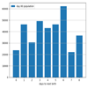
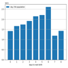
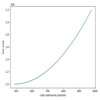
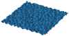
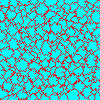

# AoC21
Python solutions to https://adventofcode.com/2021

## Install venv, update packages and run all tests

```cmd
$ ./test.ps1
```

## Single day

```cmd
$ pyenv38\scripts\activate
$ py day<n>.py
```

## Notes

* An objective this year is to provide visualizations for all solutions using PIL (png/gif) and matplotlib
* [utils.py](./utils.py) - contains general purpose helper functions and test functions

## Diary

Day | Part | Visualisation | Difficulty | Notes
--- | ---- | ------------- | ---------- | -----
day1 [🌐](https://adventofcode.com/2021/day/1)[💾](./day1.py)    | both |                              | 1/10 | Sonar Sweep - 3 list generators and a sum to map the sea floor
day2 [🌐](https://adventofcode.com/2021/day/2)[💾](./day2.py)    | both |                             | 1/10 | Dive! - parse text to move the submarine
day3 [🌐](https://adventofcode.com/2021/day/3)[💾](./day3.py)    | 1    | [](./output/day3a.png) | 2/10 | Binary Diagnostic - collections.Counter makes light work of counting bit values. Visualization shows 1/0 split by bitpos
day3 [🌐](https://adventofcode.com/2021/day/3)[💾](./day3.py)    | 2    | [](./output/day3b.png) | 3/10 | Binary Diagnostic -  read carefully and recalculate counter after each filter! Visualization shows filter as we progress through bits
day4 [🌐](https://adventofcode.com/2021/day/4)[💾](./day4.py)    | 1    |                             | 4/10 | Giant Squid - beat the squid at bingo using [x::n] slice notation for bingo card column check. Visualization is animated stack of all 100 cards (1 per row) as the colored numbers are removed
day4 [🌐](https://adventofcode.com/2021/day/4)[💾](./day4.py)    | 2    |                             | 3/10 | Giant Squid -  lose to the squid instead. Visualization as part 1 but goes further in order to find last winner slight pause is where it restarts part2 with all numbers active again on same map
day5 [🌐](https://adventofcode.com/2021/day/5)[💾](./day5.py)    | 1    | [](./output/day5a.png) | 2/10 | Hydrothermal Venture - danger spots were easy to map using my 2d Map class which also handily provides the visualization
day5 [🌐](https://adventofcode.com/2021/day/5)[💾](./day5.py)    | 2    | [](./output/day5b.png) | 2/10 | Hydrothermal Venture -  improved the part one map drawing to create a single function with a tidier solution that supports diagonals
day6 [🌐](https://adventofcode.com/2021/day/6)[💾](./day6.py)    | 1    | [](./output/day6a.png) | 2/10 | Lanternfish - easy to brute force with a list by adding children as they're born - beware O(n²) takes 1.393 se3conds for 80 days
day6 [🌐](https://adventofcode.com/2021/day/6)[💾](./day6.py)    | 2    | [](./output/day6b.png) | 4/10 | Lanternfish -  you knew it was coming, brute force becomes impossible so forced to optimise.  Started by reasoning that collections.Counter population for one day 0 fish population after 16 days could be used 16 times for each day 0 fish to make 256 days then realised that applied all the way to 1 day where the only thing that needed "calculating" was new fish added to counter and update counter keys. O(n) for 256 days is *much* quicker (and simpler) than O(n²) for 80!
day7 [🌐](https://adventofcode.com/2021/day/7)[💾](./day7.py)    | 1    |                                                    | 2/10 | The Treachery of Whales - aligned crabs by moving the lowest population end inwards until they all met could be optimised to step multiple steps
day7 [🌐](https://adventofcode.com/2021/day/7)[💾](./day7.py)    | 2    | [](./output/day7b.png) | 3/10 | The Treachery of Whales -  possible to single step with guess and fuel calculate, slower but sure and good for graphing, solution is the turning point of quadratic curve graph so it's probably possible to calculate the formula directly and solve for the turning point
day8 [🌐](https://adventofcode.com/2021/day/8)[💾](./day8.py)    | both |                                                    | 2/10 | Seven segment search - counting solves part 1 and simple set logic solves part 2, it would have only been slightly trickier if we needed to work out exactly which letter controlled which segment so I'm pleased we weren't asked to
day9 [🌐](https://adventofcode.com/2021/day/9)[💾](./day9.py)    | 1    | [](./output/day9a.png) | 2/10 | Smoke Basin - A fairly simple 2-D array accumulate results (risk) based on surrounding data (terrain) which might look nice if I change it to a pyplot countour map but doesn't look too bad just shaded in 2D
.                                                                 | 1    | [](./output/day9a2.png) |    | Smoke Basin - contour map,  for science!
day9 [🌐](https://adventofcode.com/2021/day/9)[💾](./day9.py)    | 2    | [](./output/day9b.gif) | 4/10 | Smoke Basin - used a breadth first search to fill each basin and return basin sizes, the animated gif behind the thumbnail takes *ages* if it ignores the 5ms frame duration!
day10 [🌐](https://adventofcode.com/2021/day/10)[💾](./day10.py) | 1    |  | 3/10 | Syntax Scoring - I initially blundered into a regex trap to search for invalid characters and took far too long to realise the solution was much simpler
day10 [🌐](https://adventofcode.com/2021/day/10)[💾](./day10.py) | 2    |  | 2/10 | Syntax Scoring - once I'd done part 1, I could reuse most of it to make part 2 easy
day11 [🌐](https://adventofcode.com/2021/day/11)[💾](./day11.py) |      |  |  | 
day12 [🌐](https://adventofcode.com/2021/day/12)[💾](./day12.py) |      |  |  | 
day13 [🌐](https://adventofcode.com/2021/day/13)[💾](./day13.py) |      |  |  | 
day14 [🌐](https://adventofcode.com/2021/day/14)[💾](./day14.py) |      |  |  | 
day15 [🌐](https://adventofcode.com/2021/day/15)[💾](./day15.py) |      |  |  | 
day16 [🌐](https://adventofcode.com/2021/day/16)[💾](./day16.py) |      |  |  | 
day17 [🌐](https://adventofcode.com/2021/day/17)[💾](./day17.py) |      |  |  | 
day18 [🌐](https://adventofcode.com/2021/day/18)[💾](./day18.py) |      |  |  | 
day19 [🌐](https://adventofcode.com/2021/day/19)[💾](./day19.py) |      |  |  | 
day20 [🌐](https://adventofcode.com/2021/day/20)[💾](./day20.py) |      |  |  | 
day21 [🌐](https://adventofcode.com/2021/day/21)[💾](./day21.py) |      |  |  | 
day22 [🌐](https://adventofcode.com/2021/day/22)[💾](./day22.py) |      |  |  | 
day23 [🌐](https://adventofcode.com/2021/day/23)[💾](./day23.py) |      |  |  | 
day24 [🌐](https://adventofcode.com/2021/day/24)[💾](./day24.py) |      |  |  | 
day25 [🌐](https://adventofcode.com/2021/day/25)[💾](./day25.py) |      |  |  | 

