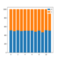
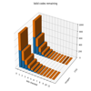
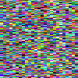
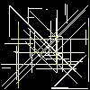

# AoC21
Python solutions to https://adventofcode.com/2021

## Install venv, update packages and run all tests

```cmd
$ ./test.ps1
```

## Single day

```cmd
$ pyenv38\scripts\activate
$ py day<n>.py
```

## Notes

* An objective this year is to provide visualizations for all solutions using PIL (png/gif) and matplotlib
* [utils.py](./utils.py) - contains general purpose helper functions and test functions

## Diary

Day | Part | Visualisation | Difficulty | Notes
--- | ---- | ------------- | ---------- | -----
day1 [🌐](https://adventofcode.com/2021/day/1)[💾](./day1.py)    | both |                     | 1/10 | The expected couple of python generators to solve a trivial data problem
day2 [🌐](https://adventofcode.com/2021/day/2)[💾](./day2.py)    | both |                   | 1/10 | parse text input and process
day3 [🌐](https://adventofcode.com/2021/day/3)[💾](./day3.py)    | 1    | [](./output/day3a.png) | 2/10 | collections.Counter is very useful
day3 [🌐](https://adventofcode.com/2021/day/3)[💾](./day3.py)    | 2    | [](./output/day3b.png) | 3/10 | Read carefully and recalculate counter after each filter!
day4 [🌐](https://adventofcode.com/2021/day/4)[💾](./day4.py)    | 1    |  | 4/10 | uses [x::n] slice notation for bingo card column check
day4 [🌐](https://adventofcode.com/2021/day/4)[💾](./day4.py)    | 2    |   | 3/10 | slight change to part1 only
day5 [🌐](https://adventofcode.com/2021/day/5)[💾](./day5.py)    | 1    | [](./output/day5a.png) | 2/10 | improved after solving part 2
day5 [🌐](https://adventofcode.com/2021/day/5)[💾](./day5.py)    | 2    | [](./output/day5b.png) | 2/10 | easier than part 1 and refactored work to a single function
day6 [🌐](https://adventofcode.com/2021/day/6)[💾](./day6.py)    |      |  |  | 
day7 [🌐](https://adventofcode.com/2021/day/7)[💾](./day7.py)    |      |  |  | 
day8 [🌐](https://adventofcode.com/2021/day/8)[💾](./day8.py)    |      |  |  | 
day9 [🌐](https://adventofcode.com/2021/day/9)[💾](./day9.py)    |      |  |  | 
day10 [🌐](https://adventofcode.com/2021/day/10)[💾](./day10.py) |      |  |  | 
day11 [🌐](https://adventofcode.com/2021/day/11)[💾](./day11.py) |      |  |  | 
day12 [🌐](https://adventofcode.com/2021/day/12)[💾](./day12.py) |      |  |  | 
day13 [🌐](https://adventofcode.com/2021/day/13)[💾](./day13.py) |      |  |  | 
day14 [🌐](https://adventofcode.com/2021/day/14)[💾](./day14.py) |      |  |  | 
day15 [🌐](https://adventofcode.com/2021/day/15)[💾](./day15.py) |      |  |  | 
day16 [🌐](https://adventofcode.com/2021/day/16)[💾](./day16.py) |      |  |  | 
day17 [🌐](https://adventofcode.com/2021/day/17)[💾](./day17.py) |      |  |  | 
day18 [🌐](https://adventofcode.com/2021/day/18)[💾](./day18.py) |      |  |  | 
day19 [🌐](https://adventofcode.com/2021/day/19)[💾](./day19.py) |      |  |  | 
day20 [🌐](https://adventofcode.com/2021/day/20)[💾](./day20.py) |      |  |  | 
day21 [🌐](https://adventofcode.com/2021/day/21)[💾](./day21.py) |      |  |  | 
day22 [🌐](https://adventofcode.com/2021/day/22)[💾](./day22.py) |      |  |  | 
day23 [🌐](https://adventofcode.com/2021/day/23)[💾](./day23.py) |      |  |  | 
day24 [🌐](https://adventofcode.com/2021/day/24)[💾](./day24.py) |      |  |  | 
day25 [🌐](https://adventofcode.com/2021/day/25)[💾](./day25.py) |      |  |  | 

