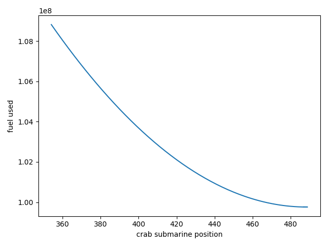

# AoC21
Python solutions to https://adventofcode.com/2021

## Install venv, update packages and run all tests

```cmd
$ ./test.ps1
```

## Single day

```cmd
$ pyenv38\scripts\activate
$ py day<n>.py
```

## Notes

* An objective this year is to provide visualizations for all solutions using PIL (png/gif) and matplotlib
* [utils.py](./utils.py) - contains general purpose helper functions and test functions
* [visualizations.py](./visualizations.py) - contains code for generating visualizations and is not required to solve any of the problems, putting them all here helps keep the solutions clean
* Difficulty ratings are my opinion at the end and not necessarily indicative of how long it took me to solve them..

	1. easy enough to do in the interpreter
	2. best to use an editor
	3. best solution is not obvious
	4. read, understand, think..., do
	5. read, understand, think..., repeat, do
	6. this could take a while to implement and/or debug ([Intcode computing](https://adventofcode.com/2019/day/17#part2))
	7. it's going to be a long night ([recursive maze mapping](https://adventofcode.com/2019/day/20#part2))
	8. one for the weekend ([dynamic maze searching](https://adventofcode.com/2019/day/18#part2))
	9. one for January ([goblins vs elves](https://adventofcode.com/2018/day/15#part2))
	10. one for someone else ([chinese remainder theorem](https://adventofcode.com/2020/day/13#part2))

## Diary

Day | Visualisation | Difficulty | Notes
--- | ------------- | ---------- | -----
day1 [🌐](https://adventofcode.com/2021/day/1)[💾](./day1.py)    | [](./output/day1.png)     | 1/10 | Sonar Sweep - 3 list generators and a sum to map the sea floor
day2 [🌐](https://adventofcode.com/2021/day/2)[💾](./day2.py)    | [](./output/day2b.png)   | 1/10 | Dive! - parse text to move the submarine
day3 [🌐](https://adventofcode.com/2021/day/3)[💾](./day3.py)    | [](./output/day3a.png)   | 2/10 | Binary Diagnostic #1 - collections.Counter makes light work of counting bit values. Visualization shows 1/0 split by bitpos
&nbsp;                                                            | [](./output/day3b.png)   | 3/10 | Binary Diagnostic #2 -  read carefully and recalculate counter after each filter! Visualization shows filter as we progress through bits
day4 [🌐](https://adventofcode.com/2021/day/4)[💾](./day4.py)    | [](./output/day4a.gif)   | 4/10 | Giant Squid #1 - beat the squid at bingo using [x::n] slice notation for bingo card column check. Visualization is animated stack of all 100 cards (1 per row) as the colored numbers are removed
&nbsp;                                                            | [](./output/day4b.gif)   | 3/10 | Giant Squid #2 -  lose to the squid instead. Visualization as part 1 but goes further in order to find last winner slight pause is where it restarts part2 with all numbers active again on same map
day5 [🌐](https://adventofcode.com/2021/day/5)[💾](./day5.py)    | [](./output/day5a.png)   | 2/10 | Hydrothermal Venture #1 - danger spots were easy to map using my 2d Map class which also handily provides the visualization
&nbsp;                                                            | [](./output/day5b.png)   | 2/10 | Hydrothermal Venture #2 - improved the part one map drawing to create a single function with a tidier solution that supports diagonals
day6 [🌐](https://adventofcode.com/2021/day/6)[💾](./day6.py)    | [](./output/day6a.png)   | 2/10 | Lanternfish #1 - easy to brute force with a list by adding children as they're born - beware O(n²) takes 1.393 se3conds for 80 days
&nbsp;                                                            | [](./output/day6b.png)   | 4/10 | Lanternfish #2 -  you knew it was coming, brute force becomes impossible so forced to optimise.  Started by reasoning that collections.Counter population for one day 0 fish population after 16 days could be used 16 times for each day 0 fish to make 256 days then realised that applied all the way to 1 day where the only thing that needed "calculating" was new fish added to counter and update counter keys. O(n) for 256 days is *much* quicker (and simpler) than O(n²) for 80!
day7 [🌐](https://adventofcode.com/2021/day/7)[💾](./day7.py)    | 🚫 | 2/10 | The Treachery of Whales #1 - aligned crabs by moving the lowest population end inwards until they all met could be optimised to step multiple steps
&nbsp;                                                            | [](./output/day7b.png)   | 3/10 | The Treachery of Whales #2 -  possible to single step with guess and fuel calculate, slower but sure and good for graphing, solution is the turning point of quadratic curve graph so it's probably possible to calculate the formula directly and solve for the turning point
day8 [🌐](https://adventofcode.com/2021/day/8)[💾](./day8.py)    | 🛠 | 2/10 | Seven segment search - counting solves part 1 and simple set logic solves part 2, it would have only been slightly trickier if we needed to work out exactly which letter controlled which segment so I'm pleased we weren't asked to
day9 [🌐](https://adventofcode.com/2021/day/9)[💾](./day9.py)    | [](./output/day9a.png)   | 2/10 | Smoke Basin #1 - A fairly simple 2-D array accumulate results (risk) based on surrounding data (terrain) which might look nice if I change it to a pyplot terrain map but doesn't look too bad just shaded in 2D
&nbsp;                                                            | [](./output/day9a2.png) |      | Smoke Basin #1 - I was right! although it took a while to prove it.
&nbsp;                                                            | [](./output/day9b.gif)   | 4/10 | Smoke Basin #2 - used a breadth first search to fill each basin and return basin sizes, the animated gif behind the thumbnail takes *ages* if it ignores the 5ms frame duration!
day10 [🌐](https://adventofcode.com/2021/day/10)[💾](./day10.py) | 🚫 | 3/10 | Syntax Scoring #1 - I initially blundered into a regex trap to search for invalid characters and took far too long to realise the solution was much simpler
&nbsp;                                                            | 🚫 | 2/10 | Syntax Scoring #2 - once I'd done part 1, I could reuse most of it to make part 2 easy
day11 [🌐](https://adventofcode.com/2021/day/11)[💾](./day11.py) | [](./output/day11a.gif) | 4/10 | Dumbo Octopus #1 - Used a processing queue similar to basin filling to update the octopi and obviously had to animate it
&nbsp;                                                            | [](./output/day11b.gif) | 2/10 | Dumbo Octopus #2 - thankfully it didn't take long to synchronize, so the only work was to refactor octopus updates in part 1 solution for reuse in part 2
day12 [🌐](https://adventofcode.com/2021/day/12)[💾](./day12.py) | 🚫 | 4/10 | Passage Pathing #1 - I briefly feared this could be a network problem and was relieved to see it was just recursion with no difficult infinite (2 large caves connected) cases and well below Pythons 1000 recursion limit
&nbsp;                                                            | 🚫 | 4/10 | Passage Pathing #2 - Slightly trickier as it adds more cases, but the problem solving was mostly done in part 1, while it pained me to destroy the brevity of my part 1 recursive function, it satisfied me more to make it reusable in both parts
day13 [🌐](https://adventofcode.com/2021/day/13)[💾](./day13.py) | [](./output/day13a.png) | 3/10 | Transparent Origami #1 - I avoided the temptation to map the points and just applied the fold function to each data point, should have been very easy but I had a nasty bug in my fold function from not explicitly checking y axis after x axis left me folding some y points on some x folds leading to y axis desync :(
&nbsp;                                                            | [](./output/day13b.png) | 2/10 | Transparent Origami #2 - I actually had this working before part 1, so I made it more difficult for myself by decoding the remaining dots programatically instead of by eye and implemented a 4x6 font decoder in [utils](https://github.com/chrislast/AoC21/blob/main/utils.py#L176)
day14 [🌐](https://adventofcode.com/2021/day/14)[💾](./day14.py) | 🚫 | 3/10 | Extended Polymerization #1 - Simple enough to brute force - repeatedly generate exponentially growing string then run it through the flavour-of-the-season Counter class
&nbsp;                                                            | 🚫 | 5/10 | Extended Polymerization #2 - Switched to recursion to avoid string memory problems and that took over 5 minutes without completing the first letter pair. After a rethink I realised caching the counter values for each letter pair at each level would speed things up by avoiding unnecessary recursion to calculate the same pair twice but I was *amazed* when the correct answer returned in less than 1/10th of a second 😮
day15 [🌐](https://adventofcode.com/2021/day/15)[💾](./day15.py) | [](./output/day15a.png) | 4/10 | Chiton #1 - Breadth first search with a twist - risk level means the processing queue needs to stay sorted by risk with each new entry.  Optimised further to add a dict based queue and avoid all costly sorting.
&nbsp;                                                            | [](./output/day15b.png) | 5/10 | Chiton #2 - 25 times bigger with modified risks.   I decided not to generate the 25x bigger array but to write a function to convert out of bound coordinates to calculated risk.  It worked, but I suspect if I'd created the 25x bigger array it would have run much quicker.
day16 [🌐](https://adventofcode.com/2021/day/16)[💾](./day16.py) | 🛠 | 6/10 | Packet Decoder #1 - My first late night, reading the requirements took long enough, I settled for a solution where I just incremented a "pointer" to the binary encoded input string and added a helper function get() to update the pointer as it consumed and returned values
&nbsp;                                                            |  | 5/10 | Packet Decoder #2 - My decision in #1 to store subpackets as a list of packets and literals in the packet payload made it fairly easy to add part 2 and reuse the same protocol parser, much quicker than part 1 and working very quickly with no need to debug using the test data
day17 [🌐](https://adventofcode.com/2021/day/17)[💾](./day17.py) |  | 4/10 | Trick Shot #1 - The solution was simple enough once you notice that the parabola crosses the launch point again at x=0 on the way down limiting the solutions to yvel < ymin.  I didn't notice that for a day.
&nbsp;                                                            |  | 7/10 | Trick Shot #2 - The search space as a square of valid x and valid y values is huge,  1.1M simulations later (**30 minutes 9 seconds**) I had my second star but there has to be a better way.  Most of the search space can probably be eliminated before simulation...
day18 [🌐](https://adventofcode.com/2021/day/18)[💾](./day18.py) |  |  | Snailfish #1 - Seemed easy enough build a binary tree.
&nbsp;                                                            |  |  | Snailfish #2 - 
day19 [🌐](https://adventofcode.com/2021/day/19)[💾](./day19.py) |  |  | 
day20 [🌐](https://adventofcode.com/2021/day/20)[💾](./day20.py) |  |  | 
day21 [🌐](https://adventofcode.com/2021/day/21)[💾](./day21.py) |  |  | 
day22 [🌐](https://adventofcode.com/2021/day/22)[💾](./day22.py) |  |  | 
day23 [🌐](https://adventofcode.com/2021/day/23)[💾](./day23.py) |  |  | 
day24 [🌐](https://adventofcode.com/2021/day/24)[💾](./day24.py) |  |  | 
day25 [🌐](https://adventofcode.com/2021/day/25)[💾](./day25.py) |  |  | 

